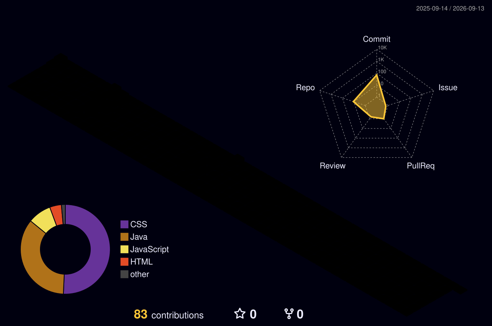

<h1 align="center">HI! My name is Nicolas!</h1>

###

⠀⠀⣠⡶⠂⠀⠀⠀⠀⠀⠀⠀⠀⠀⠀⠀⠀⠀⠀⠀⠀ ⠀⣰⣿⠃⠀⠀⠀⠀⠀⠀⠀⢀⣀⡀⠀⠀⠀⠀⠀⠀⠀           ⢸⣿⣯⠀⠀⠀⠀⠀⠀⢠⣴⣿⣿⣿⣿⣦⠀⠀⠀⠀⠀ ⢼⣿⣿⣆⠀⢀⣀⣀⣴⣿⣿⣿⠋⠀⠀⠀⠀⠀⠀⠀⠀ ⢸⣿⣿⣿⣿⣿⣿⣿⠿⠿⣿⡇⠀⠀⠀⠀⠀⠀⠀⠀⠀  @Sit down and have a coffee! ⠀⢻⣿⠋⠙⢿⣿⣿⡀⠀⣿⣷⣄⠀⠀⠀⠀⠀⠀⠀⠀ ⠀⢸⠿⢆⣀⣼⣿⣿⣿⣿⡏⠀⢹⠀⠀⠀⠀⠀⠀⠀⠀ ⠀⠀⡀⣨⡙⠟⣩⣙⣡⣬⣴⣤⠏⠀⠀⠀⠀⠀⠀⣀⡀ ⠀⠀⠙⠿⣿⣿⣿⣿⣿⣿⣿⣧⠀⠀⠀⣀⣤⣾⣿⣿⡇ ⠀⠀⠀⠀⠀⢀⣿⣿⣿⣿⣿⣿⣇⠀⢸⣿⣿⠿⠿⠛⠃ ⠀⠀⠀⠀⢠⣿⣿⢹⣿⢹⣿⣿⣿⢰⣿⠿⠃⠀⠀⠀⠀ ⠀⢀⣀⣤⣿⣿⣿⣿⣿⣿⣿⣿⣿⣷⡛⠀⠀⠀⠀⠀⠀ ⠀⠻⠿⣿⣿⣿⣿⣿⣿⣿⣿⡿⠿⠿⠛⠓⠀⠀⠀⠀⠀ ⠀⠀⠀⠀⠀⠀⠀⠉⠀⠉⠈⠁⠀⠀⠀⠀⠀⠀⠀⠀⠀

###

  ## About Me - 💻 I'm a passionate **software developer** focused on full-stack development   - 🎯 Always learning new technologies and improving coding skills   - ☕ @Sit down and have a coffee!      <table>   <tr>     <th style="text-align: left;">Category</th>     <th style="text-align: left;">Skill</th>   </tr>   <tr>     <td><b>Frameworks</b></td>     <td>            </td>   </tr>   <tr>     <td><b>Languages</b></td>     <td>                                        </td>   </tr>   <tr>     <td><b>Databases</b></td>     <td>            </td>   </tr>   <tr>     <td><b>OS</b></td>     <td>            </td>   </tr>   <tr>     <td><b>Versioning</b></td>     <td>                   </td>   </tr>   <tr>     <td><b>IDE & Environments</b></td>     <td>                          </td>   </tr> </table>   

###

  

###

